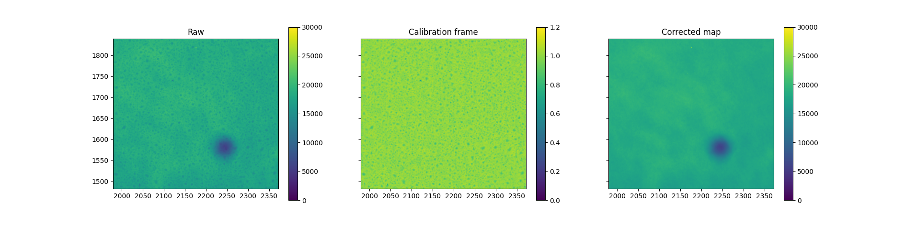

# SUIT Contamination Correction 🧹 ☀️ 🛰️ 

The SUIT instrument on Aditya-L1 maintains its image sensor at a very low temperature (-55 degC). This causes some volatiles to condense on the CCD surface. Traces of these contaminants are seen in the images recorded by SUIT.
This collection of modules is necessary to remove the contaminants from the SUIT images.

## Principle
The Aditya-L1 satellite has a jitter about its three axes. Jitter about the Pitch and Roll axes causes the image to shift randomly on the SUIT CCD. We exploit this as a dither by computing the exact shifts in the image, accurate to the pixel.

When the solar features are aligned, one particular contaminant pattern covers different regions of the Sun. This is exploited to generate a flat-field calibration file to remove the contaminants from each un aligned solar image.

## Modules 
The modules are designed to be user friendly- for implementation by the end user.

### `full_disk_correction.py`: 
- Applies contaminant correction on full disk images.
- Requires atleast 10-15 frames for correction.
- Not advised for synoptic 4k NB03, NB04, NB08 channels.
- **Methodology:** Aligns line channel images by cross-correlating the solar north limb. Aligns continuum images using sun center parameters `CRPIX` values.

### `roi_contt_correction.py`
- To apply contamination correction for RoI continuum channel images. 
- Works best for NB03 and NB04 feature rich images.
- Requires at least 10-15 images to work best.
- **Methodology**- Requires 10-15 4k images of the same band. Generates calibration file from 4k images. Applies correction on RoI by cutting the calibration file using `X1`, `Y1`, `NAXIS` values.

### `roi_line_correction.py`
- To apply contamination correction for RoI continuum channel images. 
- Works best for NB03 and NB04 feature rich images.
- Requires at least 10-15 images to work best.
- Aligns images by correlating features with the reference frame.
- Takes each image in the stack as reference, and corrects them individually.
- Computationally intensive.

### `validation_with_iris.py`
- Used to validate photometry with IRIS SJI images. 
- Applicable only for NB03 and NB04 RoI images.

## Authors

- [@janmejoysarkar](https://github.com/janmejoysarkar)

## Acknowledgements

 - [ISRO, Aditya-L1](https://www.isro.gov.in/Aditya_L1.html)
## Screenshots

## Usage/Examples
Folder structure for data

    ./data/raw/normal_4k
    ./data/raw/normal_roi

Folder structure for products

    ./products/roi
    ./products/full_disk

